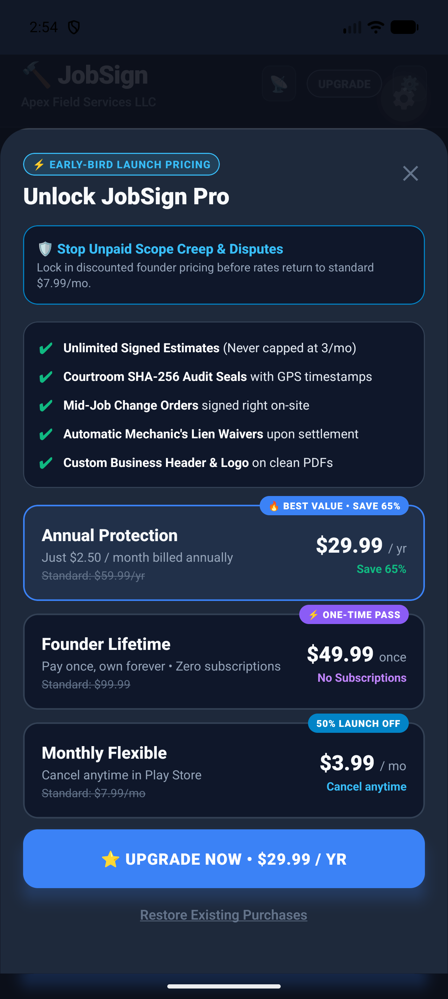
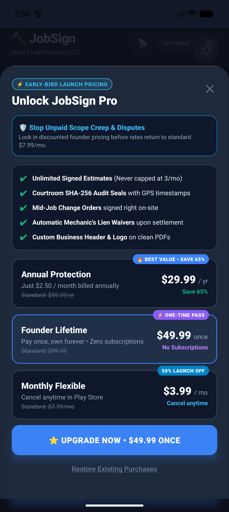
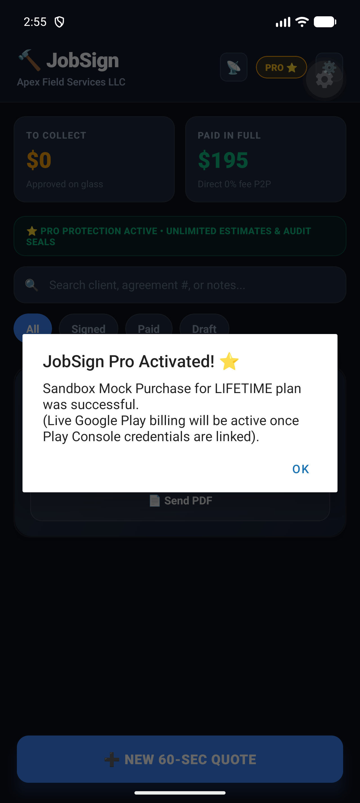
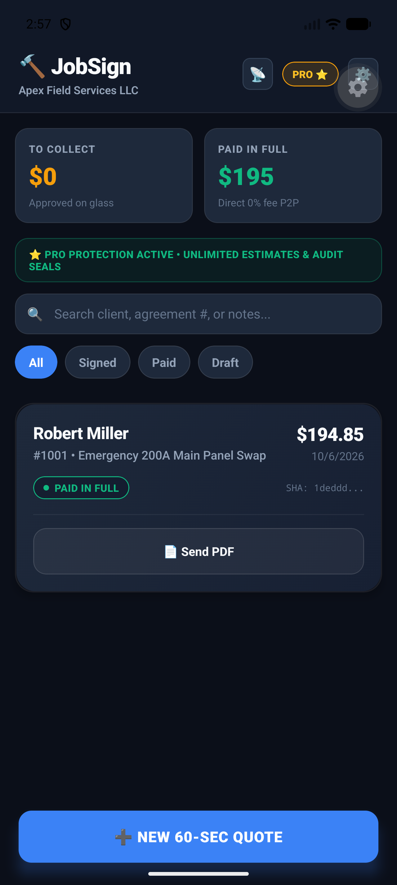

# JobSign: In-App Purchases (IAP) Implementation & Activation Guide

**SDK Integration:** RevenueCat SDK (`react-native-purchases`)  
**Target Platforms:** Google Play Store (Android) & Apple App Store (iOS)  
**Entitlement ID:** `pro_access`  
**Free Tier Quota:** 3 signed agreements / calendar month  
**Status:** **Implemented, Verified on Device, and Ready for Store Key Injection**

---

## 1. What Has Been Implemented

1. **RevenueCat Billing Engine (`BillingService.ts`):**
   - Clean initialization with API key resolution (`BILLING_CONFIG.REVENUECAT_GOOGLE_API_KEY`).
   - Real-time customer entitlement listener (`addCustomerInfoUpdateListener`).
   - Dynamic offering package fetching with fallback to early-bird launch models in dev/sandbox.
   - Secure purchase and restore flow (`purchasePro`, `restorePurchases`).
   - Offline-proof local caching in SQLite/AsyncStorage: contractors working in concrete basements never lose Pro access when cell reception drops.

2. **Early-Bird Low-Cost Launch Pricing (`BILLING_CONFIG` & `PaywallModal.tsx`):**
   - Specifically structured with introductory low-friction pricing to maximize early conversion among solo tradespeople:
     - **Annual Protection (Most Popular):** **\$29.99 / year** (~~\$59.99/yr~~, equals **\$2.50 / month**, Save 65%).
     - **Founder Lifetime Pass:** **\$49.99 one-time** (~~\$99.99~~, pay once, own forever, zero subscriptions).
     - **Monthly Flexible:** **\$3.99 / month** (~~\$7.99/mo~~, 50% launch discount, cancel anytime).

3. **Quota & Gating Enforcement (`useQuoteStore.ts` & `HomeScreen.tsx`):**
   - `getMonthlyQuoteUsage()` tracks monthly quotes reactively.
   - HomeScreen displays dynamic Free Tier indicator: `⚡ FREE TIER: X of 3 quotes used this month • Upgrade for $2.50/mo ⭐️`.
   - If free quota is reached (3 quotes), tapping `➕ NEW 60-SEC QUOTE` or attempting to sign on glass triggers the Paywall with an upgrade alert.
   - Once upgraded, HomeScreen updates to `⭐️ PRO PROTECTION ACTIVE • UNLIMITED ESTIMATES & AUDIT SEALS` with a golden Pro badge.

---

## 2. Live Device Test Screenshots

| Paywall Launch Sheet | Founder Lifetime Selected | Sandbox Purchase Success | Pro Active Pipeline |
|:---:|:---:|:---:|:---:|
|  |  |  |  |

---

## 3. Details & Credentials Required From You to Complete Live Billing

To link this implementation to your live Google Play Console merchant account and receive direct revenue into your bank account, please complete and provide the following 4 items:

### Item 1: Set Up RevenueCat Account (Free up to \$2,500/mo MTR)
1. Sign up at [https://www.revenuecat.com/](https://www.revenuecat.com/) (Free tier has 0 fees until you earn over \$2,500/month).
2. Create a new Project named **JobSign**.
3. Under **Project Settings $\to$ API Keys**, copy the **Public Android API key** (it looks like `goog_xxxxxxxxxxxxxxxxxxxx`).

---

### Item 2: Enable Google Play Developer API & Service Account
Google requires a service account for RevenueCat to validate Google Play receipts:
1. Go to **Google Cloud Console** $\to$ Select or create a project linked to your Google Play Console.
2. Enable the **Google Play Android Developer API**.
3. Go to **Service Accounts** $\to$ Create Service Account named `revenuecat-billing`.
4. Role: No GCP role needed.
5. In **Keys** tab $\to$ **Add Key $\to$ Create new key (JSON)**. Download the JSON key file.
6. In **Google Play Console $\to$ Users and permissions**:
   - Invite the service account email (e.g., `revenuecat-billing@...iam.gserviceaccount.com`).
   - Grant permissions: *View financial data, orders, and cancellation survey responses* and *Manage orders and subscriptions*.
7. In **RevenueCat Dashboard $\to$ Project Settings $\to$ Apps $\to$ Android app**:
   - Upload the downloaded Service Account JSON key.
   - Enter your Android Package Name: `com.jobsign.app`.

---

### Item 3: Create In-App Products & Subscriptions in Google Play Console
In **Google Play Console $\to$ Monetization $\to$ Products**:

#### A. Subscriptions (`Monetize -> Subscriptions`):
Create 2 subscription products:
1. **Monthly Subscription:**
   - **Product ID:** `jobsign_pro_monthly_earlybird`
   - **Base Plan ID:** `monthly-launch`
   - **Billing Period:** 1 Month
   - **Price:** **\$3.99 USD** (Google Play will auto-convert to local currencies for UK, CA, AU, etc.)

2. **Annual Subscription:**
   - **Product ID:** `jobsign_pro_annual_earlybird`
   - **Base Plan ID:** `annual-launch`
   - **Billing Period:** 1 Year
   - **Price:** **\$29.99 USD**

#### B. In-App Product (Non-Consumable / Lifetime):
In **Google Play Console $\to$ In-app products**:
1. **Product ID:** `jobsign_pro_lifetime_earlybird`
2. **Name:** JobSign Founder Lifetime Pass
3. **Price:** **\$49.99 USD**
4. **Status:** Active

---

### Item 4: Configure Entitlement & Offering in RevenueCat
In the RevenueCat Dashboard:
1. Go to **Entitlements** $\to$ Create Entitlement with Identifier: `pro_access` (must match exactly).
2. Attach the 3 Google Play products created above to `pro_access`.
3. Go to **Offerings** $\to$ Open `default` offering:
   - Package `$rc_monthly` $\to$ attach `jobsign_pro_monthly_earlybird`.
   - Package `$rc_annual` $\to$ attach `jobsign_pro_annual_earlybird`.
   - Package `$rc_lifetime` $\to$ attach `jobsign_pro_lifetime_earlybird`.

---

## 4. How to Provide the Details

Once you have your RevenueCat Public API Key, simply provide:
1. **Your RevenueCat Public Android API Key:** (e.g. `goog_abc123...`)
2. (Optional for iOS): **Your RevenueCat Public Apple API Key:** (e.g. `appl_abc123...`)

We will place it into:
```bash
# In .env or mobile_app/src/config/billing.ts
EXPO_PUBLIC_REVENUECAT_GOOGLE_KEY="goog_your_real_key_here"
```
That's it! Once that key is set, the app will instantly query live Google Play Store prices and process real card/Play Balance payments with zero additional code changes.
